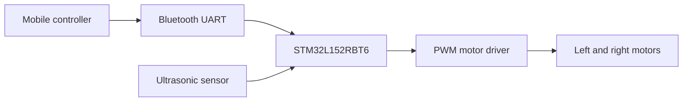

# STM32 Bluetooth & Autonomous Car

[](https://drive.google.com/file/d/1J5WSHYant_4N3TDPWJy_1uTx17psHI0A/view?usp=sharing)

A mobile-controlled and autonomous car built around an **STM32L152RBT6**. The firmware is written in **C** using **STM32CubeIDE** and combines Bluetooth/UART commands, PWM motor control, ultrasonic obstacle detection, adjustable speed, and autonomous navigation.

> **Project status:** The complete STM32CubeIDE firmware and a compatible hardware bill of materials are included.

## Demo

### [Watch the full-quality demonstration on Google Drive](https://drive.google.com/file/d/1J5WSHYant_4N3TDPWJy_1uTx17psHI0A/view?usp=sharing)

Click the project image above or the link to watch the high-quality video. The demonstration shows the STM32CubeIDE development environment, mobile command interface, assembled two-wheel chassis, control electronics, and functional testing.

## Features

- Mobile command interface
- Two-wheel motor control
- Autonomous obstacle-avoidance mode
- Ultrasonic distance measurement and proximity warning
- ADC-based speed selection
- Embedded firmware development and debugging
- Breadboard-based prototype for accessible testing
- End-to-end hardware and software demonstration

## System overview



## Repository structure

```text
microcontroller-car/
├── README.md
├── LICENSE
├── .gitignore
├── docs/
│   ├── hardware.md
│   └── firmware.md
├── firmware/
│   ├── STM32_Car.ioc
│   ├── Core/
│   ├── Drivers/
│   └── STM32L152RBTX_FLASH.ld
└── media/
    └── project-preview.jpg
```

## Hardware

The project uses an **STM32L-DISCOVERY** development board with an **STM32L152RBT6** microcontroller. It uses an HC-05 Bluetooth module on USART1, an L298N dual H-bridge for the motors, an HC-SR04 ultrasonic sensor, a 10 kΩ speed-control potentiometer, and an active buzzer. See [docs/hardware.md](docs/hardware.md) for the complete bill of materials and signal mapping.

## Software

The complete STM32CubeIDE project is in [`firmware/`](firmware). The application logic is primarily in [`firmware/Core/Src/main.c`](firmware/Core/Src/main.c).

### Bluetooth command map

| Command | Action |
| --- | --- |
| `1` | Stop |
| `2` | Forward |
| `3` | Reverse |
| `4` | Turn left |
| `5` | Turn right |
| `6` | Autonomous mode |

The STM32 sends a short text confirmation over UART after receiving each command.

### Development environment

1. Language: C
2. IDE/toolchain: STM32CubeIDE
3. Target MCU: STM32L152RBT6
4. Framework: STM32L1 HAL and CMSIS drivers included in the repository
5. Programming/debug interface: SWD/ST-LINK

## Getting started

```text
1. Clone or download this repository.
2. In STM32CubeIDE, choose **File → Import → Existing Projects into Workspace**.
3. Select the `firmware` directory.
4. Build the project and connect the STM32 board through ST-LINK/SWD.
5. Flash the firmware.
6. Power the motor circuit from a 6 V battery pack and power the development board through USB.
7. Pair the mobile controller with the HC-05 Bluetooth module.
8. Send commands `1` through `6` using the map above.
```

## What I learned

- Integrating embedded software with physical electronics
- Debugging communication between a mobile controller and a microcontroller
- Translating commands into motor behavior
- Testing wiring, power delivery, and firmware as one system

## Planned improvements

- Replace the breadboard prototype with a more permanent assembly
- Add a graphical wiring diagram
- Add wheel encoders and closed-loop speed control
- Make obstacle thresholds configurable
- Add automated firmware build validation

## Safety

Verify motor voltage, current limits, polarity, grounding, and driver specifications before powering the system. Test with the wheels raised until direction and stop behavior have been confirmed.

## License

This project is available under the [MIT License](LICENSE).
