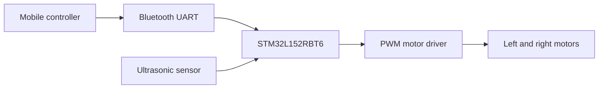

# STM32 Bluetooth & Autonomous Car

[](https://drive.google.com/file/d/1J5WSHYant_4N3TDPWJy_1uTx17psHI0A/view?usp=sharing)

A mobile-controlled and autonomous car built around an **STM32L152RBT6**. The firmware is written in **C** using **STM32CubeIDE** and combines Bluetooth/UART commands, PWM motor control, ultrasonic obstacle detection, adjustable speed, and autonomous navigation.

> **Project status:** The complete STM32CubeIDE firmware is included. Exact commercial part numbers for the Bluetooth, ultrasonic, and motor-driver modules still need confirmation.

## Demo

### [Watch the full-quality demonstration on Google Drive](https://drive.google.com/file/d/1J5WSHYant_4N3TDPWJy_1uTx17psHI0A/view?usp=sharing)

Click the project image above or the link to watch the high-quality video. The demonstration shows the STM32CubeIDE development environment, mobile command interface, assembled two-wheel chassis, control electronics, and functional testing.

## Features

- Mobile command interface
- Two-wheel motor control
- Autonomous obstacle-avoidance mode
- Ultrasonic distance measurement and proximity warning
- ADC-based speed selection
- Embedded firmware development and debugging
- Breadboard-based prototype for accessible testing
- End-to-end hardware and software demonstration

## System overview



## Repository structure

```text
microcontroller-car/
├── README.md
├── LICENSE
├── .gitignore
├── docs/
│   ├── components.md
│   └── project-notes.md
├── media/
│   ├── demo.mp4
│   └── project-preview.jpg
├── firmware/
│   ├── Car_project.ioc
│   ├── Core/
│   └── Drivers/
└── src/
    └── README.md
```

## Hardware

The project targets an **STM32L152RBT6** in an LQFP64 package. It uses USART1 for the wireless control channel, TIM4 PWM outputs for the motors, TIM2/TIM3 for ultrasonic timing, ADC1 for speed selection, and a GPIO-controlled proximity buzzer. See [docs/components.md](docs/components.md) for the component checklist.

## Software

The complete STM32CubeIDE project is in [`firmware/`](firmware). The application logic is primarily in [`firmware/Core/Src/main.c`](firmware/Core/Src/main.c).

### Bluetooth command map

| Command | Action |
| --- | --- |
| `1` | Stop |
| `2` | Forward |
| `3` | Reverse |
| `4` | Turn left |
| `5` | Turn right |
| `6` | Autonomous mode |

The STM32 sends a short text confirmation over UART after receiving each command.

### Development environment

1. Language: C
2. IDE/toolchain: STM32CubeIDE
3. Target MCU: STM32L152RBT6
4. Framework: STM32L1 HAL and CMSIS drivers included in the repository
5. Programming/debug interface: SWD/ST-LINK

## Getting started

The exact commands depend on the original firmware and toolchain. After adding them, replace this section with reproducible instructions, for example:

```text
1. Clone or download this repository.
2. In STM32CubeIDE, choose **File → Import → Existing Projects into Workspace**.
3. Select the `firmware` directory.
4. Build the project and connect the STM32 board through ST-LINK/SWD.
5. Flash the firmware.
6. Power the motor circuit using the verified supply for your hardware.
7. Pair the mobile controller with the UART Bluetooth module.
8. Send commands `1` through `6` using the map above.
```

## What I learned

- Integrating embedded software with physical electronics
- Debugging communication between a mobile controller and a microcontroller
- Translating commands into motor behavior
- Testing wiring, power delivery, and firmware as one system

## Planned improvements

- Replace the breadboard prototype with a more permanent assembly
- Add a wiring diagram and verified bill of materials
- Document the communication protocol
- Add obstacle detection or autonomous behavior
- Add repeatable firmware build instructions

## Safety

Verify motor voltage, current limits, polarity, grounding, and driver specifications before powering the system. Test with the wheels raised until direction and stop behavior have been confirmed.

## License

This project is available under the [MIT License](LICENSE).
