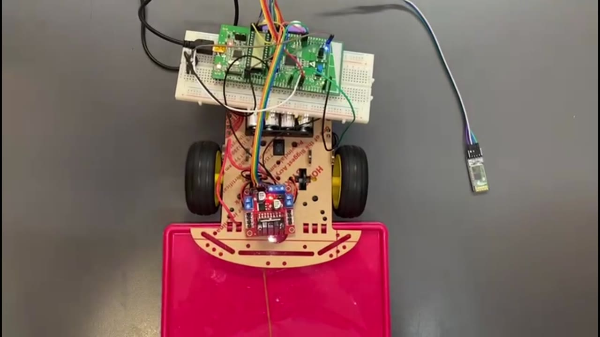

# Microcontroller Car



A mobile-controlled STM32 microcontroller car built in C using STM32CubeIDE to explore embedded programming, motor control, wireless commands, and hardware–software integration.

> **Project status:** Documentation scaffold created from the demonstration video. Add the original firmware and confirm the exact hardware before treating the build instructions as complete.

## Demo

[Watch the demonstration](media/demo.mp4)

The demonstration shows the development environment, mobile command interface, assembled two-wheel chassis, control electronics, and functional testing.

## Features

- Mobile command interface
- Two-wheel motor control
- Embedded firmware development and debugging
- Breadboard-based prototype for accessible testing
- End-to-end hardware and software demonstration

## System overview


## Repository structure

```text
microcontroller-car/
├── README.md
├── LICENSE
├── .gitignore
├── docs/
│   ├── components.md
│   └── project-notes.md
├── media/
│   ├── demo.mp4
│   └── project-preview.jpg
└── src/
    └── README.md
```

## Hardware

The video clearly shows a microcontroller-based control board, a dual-motor chassis, a motor-control board, a breadboard prototype, and a mobile control interface. Exact part numbers are intentionally left unconfirmed. See [docs/components.md](docs/components.md) for the component checklist.

## Software

The firmware was developed in **C** using **STM32CubeIDE**. Place the original STM32CubeIDE project or firmware files in `src/`. Then document:

1. The STM32CubeIDE version used.
2. The exact STM32 microcontroller or development board.
3. Required HAL drivers or libraries.
4. Build, flash, and connection steps.
5. The commands accepted by the vehicle.

## Getting started

The exact commands depend on the original firmware and toolchain. After adding them, replace this section with reproducible instructions, for example:

```text
1. Import the firmware project into STM32CubeIDE.
2. Select the exact STM32 microcontroller or board as the target.
3. Connect the board with an ST-LINK programmer and flash the firmware.
4. Power the motor circuit using <verified power source>.
5. Pair the mobile controller with <wireless module>.
6. Send the documented movement commands.
```

## What I learned

- Integrating embedded software with physical electronics
- Debugging communication between a mobile controller and a microcontroller
- Translating commands into motor behavior
- Testing wiring, power delivery, and firmware as one system

## Planned improvements

- Replace the breadboard prototype with a more permanent assembly
- Add a wiring diagram and verified bill of materials
- Document the communication protocol
- Add obstacle detection or autonomous behavior
- Add repeatable firmware build instructions

## Safety

Verify motor voltage, current limits, polarity, grounding, and driver specifications before powering the system. Test with the wheels raised until direction and stop behavior have been confirmed.

## License

This project is available under the [MIT License](LICENSE).
